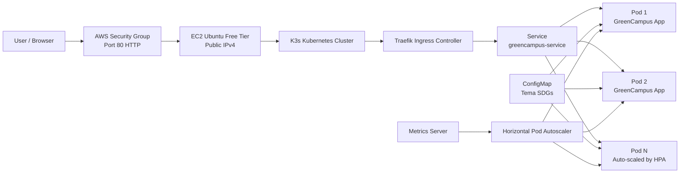

# Arsitektur Cluster

## Diagram

## Penjelasan Komponen

1. **EC2 Ubuntu Free Tier**  
   Menjadi server utama tempat Kubernetes ringan K3s berjalan.

2. **K3s Cluster**  
   Distribusi Kubernetes ringan yang cocok untuk instance kecil. K3s sudah menyediakan Traefik Ingress, ServiceLB, dan metrics-server.

3. **Deployment**  
   Menjalankan aplikasi GreenCampus dalam beberapa replica pod.

4. **ConfigMap**  
   Menyimpan konfigurasi aplikasi, seperti nama aplikasi, tema SDGs, dan pesan edukasi.

5. **Service**  
   Menyediakan alamat internal stabil untuk pod dan melakukan load balancing antar replica.

6. **Ingress**  
   Mengekspos aplikasi ke internet melalui HTTP port 80 menggunakan Traefik.

7. **HPA**  
   Mengatur jumlah pod otomatis berdasarkan penggunaan CPU.

## Alur Request

1. User membuka `http://PUBLIC-IP-EC2/`.
2. Request masuk ke Security Group AWS port 80.
3. Request diterima Traefik Ingress di cluster K3s.
4. Traefik meneruskan request ke Service.
5. Service membagi trafik ke pod aplikasi yang tersedia.
6. Jika beban CPU meningkat, HPA menambah jumlah replica.
